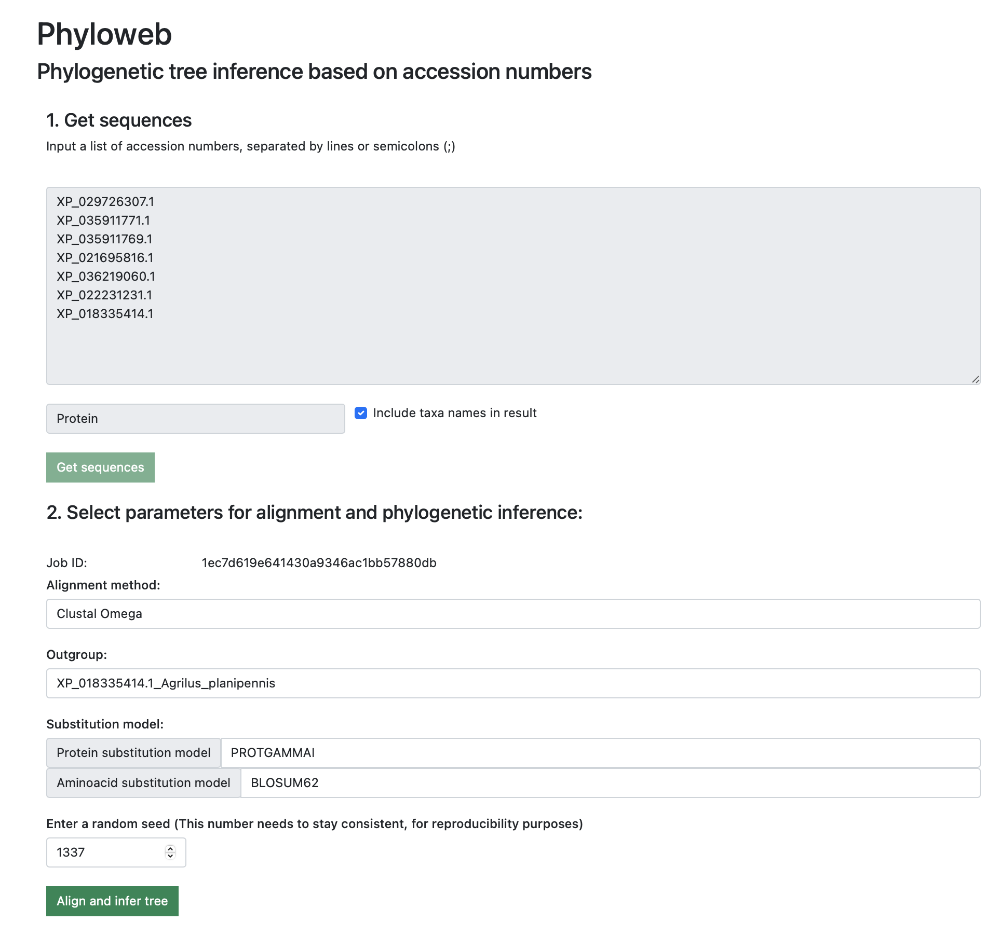
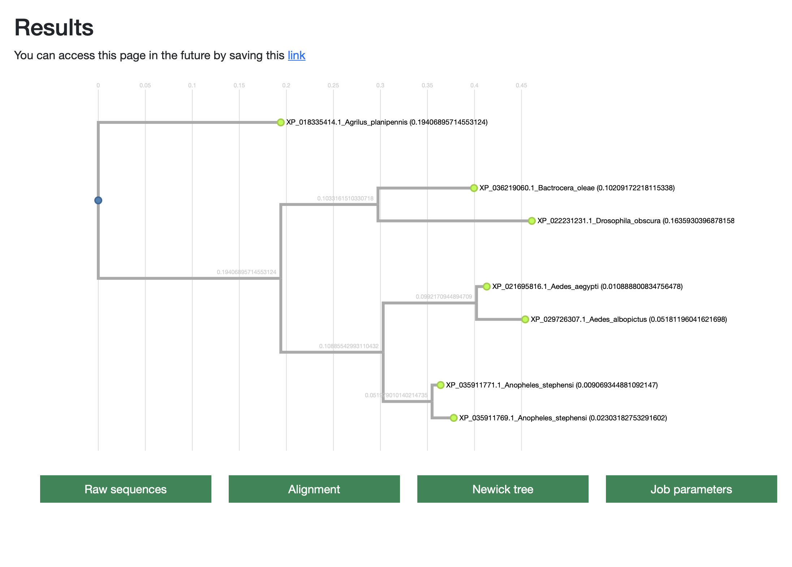

# Phyloweb


Phyloweb is a web application used to create phylogenetic trees based on accession numbers. This is performed in 3 steps:
1. Retrieval of sequences from NCBI servers using Entrez
2. Multiple sequence alignment using Clustal Omega or MAFFT
3. Inference of phylogenetic tree using RAxML

Prerequisites:
- Python 3.x
- Conda

### Setup instructions
In order to setup the app, you need to have conda installed.

Create an environment with:
```bash
conda create -n phyloweb -c conda-forge -c bioconda snakemake python=3.8.3 -y
conda activate phyloweb
```

Once created and active, run the install.sh script
```bash
chmod +x install.sh
./install.sh
```

Finally, run the app with:

```bash
flask run
```

The app will be served at localhost in port 5000 (http://127.0.0.1:5000).

## Usage
The input page of the website has the following interface:


The sequences used in this sample correspond to the Cytochrome P450 protein present in arthropods. Accession numbers for the sample are the following:
```
KAF8797238.1
ABS31131.1
EDS45242.1
AAC47424.1
PBC34359.1
ADY62482.1
AAG36792.1
AHJ59371.1
```

Settings are the following:
```
Sequence type: Protein
Include taxa names in result
Alignment method: Clustal Omega
Outgroup: KAF8797238.1
Protein substitution model: PROTGAMMA
Aminoacid substitution model: BLOSUM62
Random seed: 11111
```

Once processed, the results can be visualized and downloaded in a new page:

